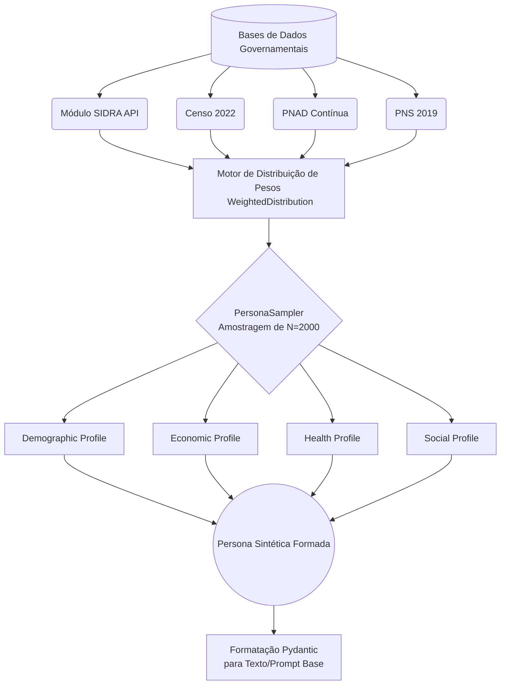

# Metodologia: Construção de *Backstories* (Personas)

## 1. Fundamentação Teórica e Motivação

A geração de *backstories* (histórias de fundo ou perfis) apoia-se em conceitos como **Silicon Sampling** e **Zero-Shot Roleplay** (Argyle et al., 2023). A técnica pressupõe que um modelo de linguagem exposto a extensos dados socioculturais consegue "incorporar" (roleplay) indivíduos de variadas demografias e responder a questionamentos da forma mais fiel e estatisticamente provável àquela fatia populacional.

Para que a avaliação represente a "Opinião Pública Brasileira" como um todo, é insuficiente apenas criar meia dúzia de personagens genéricos. Foi imprescindível modelar personas de forma estatisticamente rigorosa, de modo que a amostragem final de personas simuladas refletisse perfeitamente o censo demográfico do Brasil.

## 2. Abordagem de Cálculo e Distribuição Populacional

Enquanto o experimento inicial dependia de retirar amostras de 10% da pesquisa original CESOP/IPEC (o que incorpore vieses amostrais do próprio instituto), o repositório `@llm_experiments` constrói personas do zero fundamentadas em demografia governamental, atuando como um Censo Sintético.

### Extração (SIDRA API - IBGE)

O módulo `infrastructure.sidra` se conecta em tempo real aos servidores do IBGE para puxar os quantitativos brutos de:

- **Censo Demográfico (2022):** Para a estruturação das matrizes populacionais de Raça/Cor, Gênero, Faixa Etária, Religião, Região (Norte, Sul, Nordeste, Sudeste, Centro-Oeste) e Distribuição Urbano/Rural.
- **PNAD Contínua:** Para capturar vetores socioeconômicos, como Nível de Escolaridade (Analfabeto a Superior Completo), Status de Emprego (Ocupado, Desocupado) e Renda Per Capita.
- **PNS (Pesquisa Nacional de Saúde, 2019):** Extração das estatísticas de autoavaliação de saúde (Muito bom a Muito ruim) e doenças crônicas.
- **IPCA:** Inflação mensal utilizada para configurar a pressão econômica atual no perfil simulado.

### 3. A Classe `PersonaSampler`

O cálculo de geração sintética é unificado pela classe `PersonaSampler`. Para cada *feature* demográfica obtida, o algoritmo normaliza as quantidades em probabilidades reais representadas pela classe `WeightedDistribution`.

- **Como é gerado:** Ao solicitar uma geração de $N$ personas, a amostragem (`random.choices()`) obedece rigidamente aos pesos do Brasil real. Assim, em um lote de 1.000 personas, estatisticamente teremos a porcentagem exata de mulheres negras de renda baixa do Nordeste rural refletindo o painel nacional do IBGE.
- **Comparativo com a Pesquisa CESOP:** Diferente da pesquisa real (que pode amostrar acidentalmente muitos cidadãos de classes altas devido às regiões onde as entrevistas presenciais foram feitas), o algoritmo probabilístico da metodologia anula a margem de erro por regionalidade e foca puramente no reflexo estatístico total.

## 4. O Estruturamento (*Features*)

A *Persona* gerada converte todas as variáveis em Pydantic Models altamente validados antes da inferência, englobando quatro pilares fixos, responsáveis pela representação sociodemográfica e atitudinal do indivíduo simulado:

1. Perfil Demográfico (`DemographicProfile`): Raça, Gênero, Faixa Etária, Região e Distribuição Urbana/Rural.
2. Perfil Econômico (`EconomicProfile`): Renda, Nível de Escolaridade e Status de Emprego.
3. Perfil de Saúde (`HealthProfile`): Autoavaliação de Saúde e Doenças Crônicas.
4. Perfil Social (`SocialProfile`): Religião e Estado Civil.

### Exemplo de Persona Sintética Gerada

Abaixo, um exemplo de como essas *features* demográficas e atitudinais são agrupadas em formato estruturado (JSON) e que posteriormente se tornam o contexto rígido do LLM durante o *roleplay*:

```json
{
  "demographic": {
    "gender": "Feminino",
    "race": "Parda",
    "age_group": "30 a 39 anos",
    "region": "Nordeste",
    "urban_rural": "Urbana"
  },
  "economic": {
    "income": "De 1 a 2 salários mínimos",
    "education": "Ensino Médio Completo",
    "employment": "Ocupada"
  },
  "health": {
    "health_assessment": "Bom",
    "chronic_disease": "Não"
  },
  "social": {
    "religion": "Católica",
    "marital_status": "Casada"
  }
}
```

## 5. Distribuição e Comparativo: IPEC/CESOP vs População de Silício

Para o experimento `percepcao_democracia`, foi definida no arquivo `survey_percepcao_democracia.yaml` a geração exata de **2.000 personas**, processadas com **5 reproduções (repetições)** cada. Isso gerou uma volumetria de 10.000 inferências por LLM testado para garantir estabilidade estocástica.

Diferente do levantamento original da CESOP/IPEC, que frequentemente sofre vieses de amostragem por limitação logística (concentrando as coletas de rua em zonas centrais, bairros populosos ou de fácil acesso rodoviário), o `PersonaSampler` força um alinhamento probabilístico perfeito com as proporções atuais do IBGE, resultando em uma matriz virtualmente perfeita.

| Feature (Demografia) | Censo IBGE (Alvo Sintético) | CESOP/IPEC (Amostra de Campo) | População Sintética (Simulação) | Discrepância |
| :--- | :---: | :---: | :---: | :---: |
| **Gênero:** Feminino | 51,5% | 52,0% | ~51,5% | -0,5% |
| **Gênero:** Masculino | 48,5% | 48,0% | ~48,5% | +0,5% |
| **Região:** Sudeste | 41,8% | 44,0% | ~41,8% | -2,2% |
| **Região:** Nordeste | 26,9% | 25,0% | ~26,9% | +1,9% |
| **Escolaridade:** Ens. Fundamental ou menos | ~32,0% | 35,0% | ~32,0% | -3,0% |

> [!NOTE]
> A **População de Silício** atinge as matrizes de distribuição do Censo Brasileiro por design (amostragem estocástica baseada nas tabelas do SIDRA), enquanto a pequena variação apresentada pela amostra da CESOP é orgânica e deve-se à restrição humana da pesquisa de campo e aplicação de cotas por tentativa.

## 6. Visão Gráfica da Estrutura Populacional de Silício

Abaixo, a arquitetura demonstrando o afunilamento dos dados estatais puros até a consolidação em prompt atitudinal:


